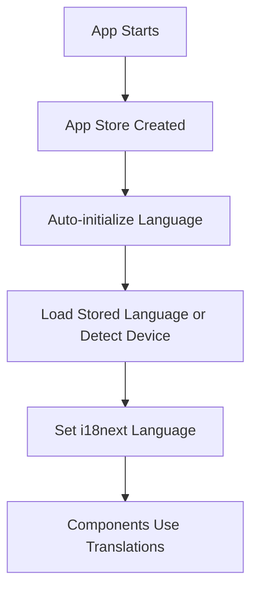

# Translation System - Phase 1 Implementation

## Overview

This document describes the implementation of the internationalization (i18n) system for HabitsApp using i18next and React Native.

## Architecture

### Core Components

1. **Translation Files** (`lib/translations/`)

   - `english.json` - Base English translations
   - Future language files will be added here

2. **i18n Configuration** (`lib/utils/i18n.ts`)

   - i18next initialization
   - Language detection
   - Supported languages configuration

3. **App Store Integration** (`lib/stores/app_state.ts`)

   - Language state management
   - Persistence with MMKV
   - Language switching functionality
   - **Auto-initialization** - Language is initialized automatically when the store is created

4. **Translation Hook** (`lib/hooks/useTranslation.ts`)

   - Type-safe translation access
   - Language switching interface
   - Integration with app store

5. **Translation Helpers** (`lib/utils/translationHelpers.ts`)
   - Utilities for complex translations
   - Measurement unit translations
   - Category translations
   - Achievement translations

## Type Safety

The system uses TypeScript module augmentation to provide type safety for translation keys:

```typescript
// lib/types/i18next.d.ts
import 'i18next';
import type english from '../translations/english.json';

declare module 'i18next' {
  interface CustomTypeOptions {
    defaultNS: 'translation';
    resources: {
      translation: typeof english;
    };
  }
}
```

This ensures that all translation keys are type-checked at compile time.

## Usage Examples

### Basic Translation

```typescript
import { useTranslation } from '@/lib/hooks/useTranslation';

function MyComponent() {
  const { t } = useTranslation();

  return <Button label={t('common.done')} onPress={handleDone} />;
}
```

### Translation with Parameters

```typescript
const { t } = useTranslation();

// For pluralization
const streakText = t('habits.streakDays', { count: 5 });

// For interpolation
const achievementText = t('achievements.streakAchievement', { days: 7 });
```

### Language Switching

```typescript
import { useTranslation } from '@/lib/hooks/useTranslation';

function LanguageSelector() {
  const { currentLanguage, changeLanguage } = useTranslation();

  const handleLanguageChange = async (language: SupportedLanguage) => {
    await changeLanguage(language);
  };

  return (
    // Language selection UI
  );
}
```

### Complex Object Translation

```typescript
import { translateMeasurementUnit } from '@/lib/utils/translationHelpers';

function UnitDisplay({ unit }: { unit: MeasurementUnit }) {
  const { t } = useTranslation();

  const translatedUnit = translateMeasurementUnit(t, unit.id, unit);

  return <Text>{translatedUnit.name}</Text>;
}
```

## Integration with App

### Simple Integration - No Provider Needed!

The language system initializes automatically when the app store is created. No additional setup is required in your app layout.

### Update Components

Replace hardcoded strings with translation calls:

```typescript
// Before
<Button label="Done" onPress={handleDone} />;

// After
const { t } = useTranslation();
<Button label={t('common.done')} onPress={handleDone} />;
```

## Supported Languages

Currently configured languages:

- **English (en)** - Default/Base language ✅ Complete
- **Spanish (es)** - ✅ Complete
- **French (fr)** - ✅ Complete
- **German (de)** - ✅ Complete
- **Portuguese (pt)** - ✅ Complete
- **Russian (ru)** - ✅ Complete

## Translation File Structure

```json
{
  "common": {
    "done": "Done",
    "cancel": "Cancel"
    // ... common UI elements
  },
  "navigation": {
    "habits": "Habits",
    "stats": "Stats"
    // ... navigation labels
  },
  "habits": {
    "title": "My Habits",
    "addHabit": "Add Habit"
    // ... habit-related translations
  },
  "units": {
    "minutes": {
      "oneName": "Minute",
      "name": "Minutes",
      "shortName": "min"
    }
    // ... measurement units
  }
}
```

## Features

### ✅ Implemented in Phase 1 & 2

- [x] i18next configuration with React Native
- [x] Type-safe translation keys
- [x] App store integration for language state
- [x] MMKV persistence for language preference
- [x] Device locale detection
- [x] Language switching functionality
- [x] Translation utilities for complex objects
- [x] **Auto-initialization** - No provider needed!
- [x] Comprehensive English translation file
- [x] Spanish translation file
- [x] French translation file
- [x] German translation file
- [x] Portuguese translation file
- [x] Russian translation file
- [x] **Language picker modal with native picker**
- [x] **All UI components translated**
- [x] **All screens translated**
- [x] **Navigation tabs translated**
- [x] **Settings screen with language picker**
- [x] **Stats components translated**
- [x] **Achievements components translated**
- [x] **Onboarding screens translated**
- [x] **Modal components translated**

### 🔄 Next Steps (Phase 3)

- [ ] Handle RTL languages (if needed)
- [ ] Performance optimization
- [ ] Widget translation support
- [ ] Add more languages as needed

## Performance Considerations

- **Auto-initialization**: Language initializes automatically with the app store
- **Lazy Loading**: Translation files are loaded on demand
- **Caching**: i18next caches translations in memory
- **Persistence**: Language preference is stored with MMKV for fast access
- **Fallback**: Always falls back to English if translation is missing
- **No Provider Overhead**: Direct store integration without React Context

## Best Practices

1. **Always use translation keys**: Never hardcode user-facing strings
2. **Provide fallbacks**: Use `defaultValue` for graceful degradation
3. **Organize keys logically**: Group related translations together
4. **Use interpolation**: For dynamic content like counts and names
5. **Test all languages**: Ensure UI layouts work with different text lengths
6. **Keep keys descriptive**: Use clear, hierarchical key names

## Architecture Benefits

### Why No Language Provider?

This implementation follows the existing app patterns by:

1. **Consistency**: Matches the existing store-based architecture
2. **Simplicity**: No additional provider wrapper needed
3. **Performance**: Avoids React Context re-renders
4. **Auto-initialization**: Language loads automatically with the app
5. **Direct Access**: Components access translations directly through the hook

### Initialization Flow



## Troubleshooting

### Common Issues

1. **Missing translations**: Check console for missing key warnings
2. **Type errors**: Ensure translation keys exist in english.json
3. **Language not changing**: Verify app store integration and persistence
4. **Performance issues**: Check for unnecessary re-renders in components

### Debug Mode

Enable i18next debug mode for development:

```typescript
// In lib/utils/i18n.ts
i18n.init({
  debug: __DEV__, // Enable debug in development
  // ... other options
});
```

This will log missing translations and other i18n events to the console.
