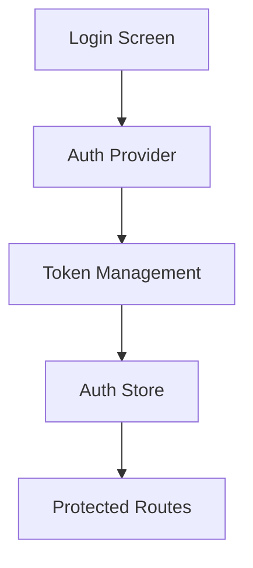
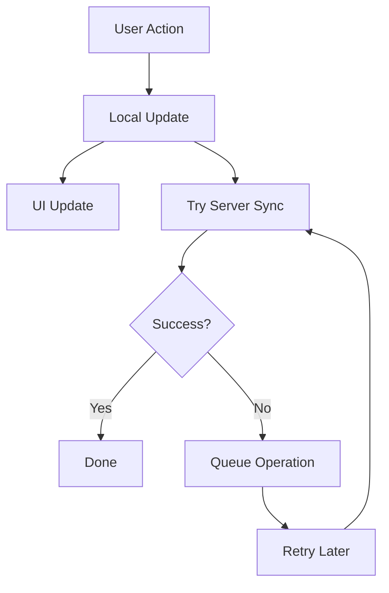
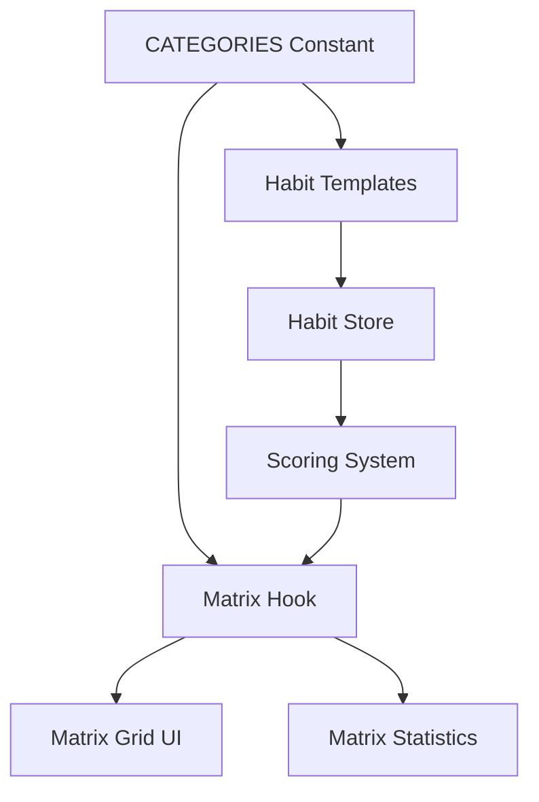

# System Patterns

## Architecture Overview

### Directory Structure

```
react-native-starter/
├── app/                   # Expo Router pages
├── components/            # Reusable components
├── interfaces/            # Zustand stores
├── types/                # TypeScript types
├── utils/                # Helper functions
├── constants/            # App constants
├── assets/              # Static assets
└── memory-bank/         # Project documentation
    ├── projectbrief.md  # Core requirements
    ├── productContext.md # Product context
    ├── systemPatterns.md # System architecture
    ├── techContext.md   # Technical setup
    ├── activeContext.md # Current state
    ├── progress.md     # Progress tracking
    └── App.md          # App-specific documentation
```

## Core Design Patterns

### State Management

1. **Zustand Store Pattern with Subscriptions & Deferred Calculations**

   ```typescript
   // Store creation with subscribeWithSelector middleware
   const useStore = create<SharedSlice>()(
     subscribeWithSelector(
       persist(
         (set, get, api) => ({
           // Initial state combining modular slices
           ...createHabitSlice(set, get, api),
           ...createCompletionSlice(set, get, api),
           ...createCalendarSlice(set, get, api),
           ...createAchievementSlice(set, get, api),
           ...createSyncSlice(set, get, api),
         }),
         options
       )
     )
   );

   // Efficient state change tracking
   useStore.subscribe(
     (state) => ({
       // Track multiple state changes in one selector
       stateA: state.someData,
       stateB: new Set(state.collection.keys()),
       count: state.items.size,
     }),
     (newState, oldState) => {
       // Handle state changes efficiently
       if (newState.stateA !== oldState.stateA) {
         // Handle stateA changes
       }
       if (newState.stateB.size !== oldState.stateB.size) {
         // Handle collection size changes
       }

       // Heavy calculations can be deferred slightly
       if (needsHeavyRecalculation(newState, oldState)) {
         setTimeout(() => {
           state.performHeavyRecalculation();
         }, 100);
       }
     }
   );
   ```

   - Use `subscribeWithSelector` for efficient state tracking
   - Combine multiple state changes in one selector
   - Use Sets and size tracking for efficient collection comparison
   - Avoid infinite loops in calculations
   - Trigger side effects based on specific state changes
   - **Optimization:** Defer potentially heavy calculations triggered by subscriptions using `setTimeout` to avoid blocking the main thread.

2. **Custom Hook Selectors (`lib/hooks/*.ts`)**

   ```typescript
   export const useSpecificData = (args) => {
     const rawData = useStore((state) => state.rawData); // Select minimal raw state
     return useMemo(() => {
       // Compute/filter derived data
     }, [rawData, args]); // Memoize based on raw data & args
   };
   ```

   - Encapsulate logic for selecting and computing derived state.
   - Subscribe to minimal raw state from the store.
   - Use `React.useMemo` to memoize calculations, preventing unnecessary re-renders.
   - Pass stable primitive types (strings, numbers) as arguments to hooks where possible.

3. **Component Data Usage**

   ```typescript
   function MyComponent(props) {
     const specificData = useSpecificData(props.stableId);
     // Render using specificData
   }
   ```

   - Components call custom hooks to get the exact memoized data they need.

### Component Patterns

- Functional components with hooks
- Props interface definitions
- Memoization via `React.memo` where needed
- Error boundary implementation

### Navigation Pattern

- File-based routing with Expo Router
- Type-safe navigation
- Deep linking support
- Modal and stack navigation

## Key Technical Decisions

### Authentication

- Multiple provider support (Apple, Google)
- Token-based authentication
- Secure storage strategy with MMKV
- Refresh token rotation

### Data Management

1. **Storage Strategy**

   - MMKV for performance-critical data
   - AsyncStorage for larger datasets
   - Supabase for backend storage
   - Offline sync capabilities

2. **State Updates**

   - Optimistic updates for instant feedback
   - Non-blocking state updates for UI responsiveness
   - Background sync with retry mechanism
   - Conflict resolution based on timestamps
   - Pending operations queue
   - Error handling with retry limits
   - Key Pattern: Avoid awaiting non-critical async operations that would block UI updates

3. **Sync Pattern**

   - Initial sync on app launch
   - Periodic sync (hourly)
   - Manual sync trigger support
   - Offline operation support
   - Conflict resolution strategy
   - Async operations run in background to prevent UI blocking

4. **State Selection/Derivation**
   - Prefer custom hooks with `useMemo` for selecting/deriving state over complex selectors within `create`
   - Keep state updates synchronous where possible for immediate UI feedback
   - Use non-blocking async operations for server sync

### Performance Optimization

1. **State Updates**

   - Immediate local state updates for UI responsiveness
   - Non-blocking async operations for server sync
   - Avoid awaiting non-critical operations
   - Measure and log critical operation timings for optimization
   - Use performance.now() for precise timing measurements

2. **UI Responsiveness**
   - Bottom sheet animations configured for optimal speed
   - Immediate feedback for user actions
   - Background processing for server operations
   - Optimistic UI updates

## Component Relationships

### Data Flow

```mermaid
graph TD
    Store[Zustand Store
      (Raw State)] --> Hooks[Custom Hooks
      (Select + Memoize)]
    Hooks --> Components[UI Components]
    Components --> Actions[Store Actions]
    Actions --> API[API Layer]
    API --> Storage[Local Storage]
    API --> Backend[Backend Services]
    API --> PendingOps[Pending Operations]
    PendingOps --> Sync[Sync Mechanism]
    Sync --> Backend
```

### Authentication Flow



### Sync Flow



## Error Handling

1. **Global Error Boundary**

   - Sentry integration
   - User-friendly error messages
   - Error recovery mechanisms
   - Debug logging

2. **Network Errors**
   - Retry logic with exponential backoff
   - Offline operation handling
   - User feedback for sync status
   - Data recovery through pending operations

## Testing Strategy

1. **Unit Tests**

   - Component testing
   - Store testing
   - Utility function testing
   - Mock implementations
   - Sync mechanism testing
   - Custom hook testing

2. **Integration Tests**
   - Navigation flows
   - API integration
   - Authentication flows
   - State management
   - Offline capability testing

## Security Patterns

1. **Data Security**

   - Secure storage
   - Data encryption
   - Token management
   - Input validation
   - Sync data validation

2. **Network Security**
   - HTTPS enforcement
   - Certificate pinning
   - Request signing
   - Rate limiting
   - Sync request validation

## Sync Implementation

1. **Core Components**

   - Pending operations queue
   - Retry mechanism
   - Conflict resolution
   - Error handling
   - Status tracking

2. **Integration Points**

   - App initialization sync
   - Post-login sync
   - Periodic background sync
   - Manual sync trigger
   - Error recovery

3. **Best Practices**
   - Optimistic updates first
   - Queue failed operations
   - Retry with backoff
   - Clear error messaging
   - Status indicators

## New Interface: Habits

1. **Zustand Store for Habits**

   - Similar to user_profile store pattern
   - First let's check the database schema from Supabase
   - Create proper TypeScript types
   - Implement the store with MMKV persistence

## Calendar Day Visualization Pattern

### WeekView Day States

The calendar day visualization uses a focused approach that concentrates completion status on the number itself:

1. Base Container

```typescript
const styles = StyleSheet.create({
  container: {
    height: 80,
    backgroundColor: '#fff', // Always white for clean look
  },
  dayContainer: {
    width: DAY_WIDTH,
    height: 70,
    justifyContent: 'center',
    alignItems: 'center',
  },
});
```

2. Selected State

```typescript
selectedDay: {
  backgroundColor: '#E3F2FF', // Light blue that works with both white and blue
  borderRadius: 12,
}
```

3. Completion States (focused on number)

```typescript
// Partial completion - circle border
someCompletedNumber: {
  borderWidth: 1.5,
  borderColor: '#007AFF',
  borderRadius: 16,
},
// Full completion - filled circle
allCompletedNumber: {
  backgroundColor: '#007AFF',
  borderRadius: 16,
}
```

4. Today State

```typescript
todayText: {
  color: '#007AFF', // Blue text for today
}
```

### Visual Hierarchy

1. Container always stays white
2. Selected day has light blue background
3. Completion status shown on number only:
   - No completion: Regular number
   - Partial: Blue circle border
   - Complete: Blue filled circle
4. Today indicated by blue text

### Key Implementation Details

- Use nested Views for number container to handle borders and backgrounds separately
- Keep completion status focused on the number for clarity
- Use borderRadius equal to half width/height for perfect circles
- Selected state uses a color that works with both white and blue elements

### Style Structure

```typescript
<TouchableOpacity
  style={[styles.dayContainer, isSelected && styles.selectedDay]}
>
  <Text style={[styles.dayName, isToday && styles.todayText]}>
    {date.format('ddd')}
  </Text>
  <View
    style={[
      styles.numberContainer,
      completionStatus === 'some_completed' && styles.someCompletedNumber,
    ]}
  >
    <View
      style={[
        styles.numberBackground,
        completionStatus === 'all_completed' && styles.allCompletedNumber,
      ]}
    >
      <Text
        style={[
          styles.dayNumber,
          isToday && styles.todayText,
          completionStatus === 'all_completed' && styles.allCompletedText,
        ]}
      >
        {date.format('D')}
      </Text>
    </View>
  </View>
</TouchableOpacity>
```

## Matrix System Architecture

### Category Management

1. **Centralized Category Definitions (`lib/constants/HabitTemplates.ts`)**

   ```typescript
   // Single source of truth for category IDs
   export const CATEGORY_IDS = [
     'body',
     'mind',
     'heart',
     'spirit',
     'work',
   ] as const;
   export type HabitCategory = (typeof CATEGORY_IDS)[number];

   // Complete category metadata
   export const CATEGORIES = [
     {
       id: 'body',
       name: 'Body',
       icon: 'body',
       description: 'Physical health and wellbeing',
       color: '#FF5E5B',
     },
     // ... other categories
   ] as const;
   ```

   - All category references use this centralized definition
   - Type-safe category IDs through TypeScript literal types
   - Complete metadata for UI components
   - Used by habit templates and scoring system

2. **Matrix Score Calculation (`lib/utils/scoring.ts`)**

   ```typescript
   interface DisplayedMatrixScore {
     body: number;
     mind: number;
     heart: number;
     spirit: number;
     work: number;
     calculated_at: Date;
   }
   ```

   - Exponential smoothing algorithm for score updates
   - Configurable smoothing factor and lookback window
   - Category-specific baseline scores
   - Daily progress score (DPS) calculation
   - Dynamic Matrix Score (DMS) computation
   - **Location:** `lib/utils/achievements.ts` (Confirm this, looks like DMS is here now)

3. **Matrix Hook (`lib/hooks/useMatrix.ts`)**

   ```typescript
   interface MatrixCategory {
     id: (typeof CATEGORY_IDS)[number] | 'total';
     name: string;
     score: number;
     color: string;
     icon: string;
     description?: string;
   }
   ```

   - Memoized matrix calculations
   - Real-time score updates
   - Balance score computation
   - Integration with habit completion tracking
   - Efficient re-rendering optimization
   - **Location:** `lib/utils/achievements.ts`

### Matrix Data Flow



### Scoring System

1. **Daily Progress Score (DPS)**

   - Calculated per category
   - Based on completed habits vs. total active habits
   - Skipped habits excluded from calculation
   - Score range: 0-100

2. **Dynamic Matrix Score (DMS)**

   - Uses exponential smoothing
   - Configurable parameters:
     - SMOOTHING_FACTOR = 0.02 (α)
     - LOOKBACK_WINDOW = 14 days
   - Baseline scores from user profile
   - Real-time updates on habit completion
   - **Location:** `lib/utils/achievements.ts` (Confirm this, looks like DMS is here now)

3. **Balance Score**
   - Average of all category scores
   - Updates dynamically with individual scores
   - Represents overall life balance

### Matrix Grid Implementation

1. **Visual Representation**

   - Category-specific colors
   - Icon-based category identification
   - Score visualization
   - Interactive elements

2. **Performance Optimization**

   - Memoized calculations
   - Efficient re-rendering
   - Background score updates
   - Smooth animations

3. **User Interaction**
   - Category selection
   - Score history viewing
   - Quick habit access
   - Progress visualization

## Other System Patterns

[Previous patterns remain unchanged...]

## State Management

### Zustand Stores

We use Zustand for global state management across the application. Each major feature has its own dedicated store:

1. `habits_store.ts` - Manages habit data, completions, and sync
2. `user_profile_store.ts` - Handles user profile and related settings (Confirm if `auth_store.ts` exists or was replaced)
3. `achievements_store.ts` - Tracks user achievements
4. `modal_store.ts` - Centralizes modal management

All stores follow consistent patterns:

```typescript
export const useHabitsStore = create<SharedSlice>()(
  subscribeWithSelector(
    persist(
      immer((set, get, api) => ({
        // State & Actions combined from modular slices
        ...createHabitSlice(set, get, api),
        ...createCompletionSlice(set, get, api),
        ...createCalendarSlice(set, get, api),
        ...createAchievementSlice(set, get, api),
        ...createSyncSlice(set, get, api),
      })),
      {
        name: 'habits-store',
        storage: {
          // MMKV storage implementation
        },
      }
    )
  )
);
```

### Performance Storage with MMKV

We've migrated from AsyncStorage to MMKV for improved performance. MMKV is a key-value storage system that offers significantly better performance than AsyncStorage.

Implementation pattern:

```typescript
// Create MMKV instance for a specific store
const habitsMmkv = new MMKV({ id: 'habits-store' });

// Configure storage interface
storage: {
  getItem: (name) => {
    const value = habitsMmkv.getString(name);
    if (!value) return null;
    return JSON.parse(value);
  },
  setItem: (name, value) => {
    habitsMmkv.set(name, JSON.stringify(value));
  },
  removeItem: (name) => {
    habitsMmkv.delete(name);
  },
},
```

Benefits:

- Faster read/write operations
- Better app startup performance
- Reduced memory usage
- Native implementation for better stability

### Selector Hooks

Custom hooks for data selection follow this pattern:

```typescript
export const useHabitsForDate = (date: Date): Habit[] => {
  const normalizedDate = useMemo(() => {
    return normalizeDate(date);
  }, [date.toISOString().split('T')[0]]);

  return useHabitsStore(
    useCallback(
      (state) => {
        return state.getHabitsForDate(normalizedDate);
      },
      [normalizedDate]
    )
  );
};
```

### Utility Functions

- Core habit logic moved to `lib/utils/habits.ts` (e.g., `calculateDateStatus`, `getHabitStatus`)
- Core achievement/scoring logic moved to `lib/utils/achievements.ts` (e.g., `calculateCurrentStreak`, `calculateDMS`)

## UI Patterns

### Modal System

The application now uses a centralized modal system with the following architecture:

1. **Modal Store**: `modal_store.ts` manages the state of all modals in the application

   ```typescript
   export type ModalType = 'achievement' | 'confirmation' | 'settings' | null;

   interface ModalState {
     currentModal: ModalType;
     // Modal-specific state and actions
   }
   ```

2. **Modal Container**: A single component that renders the appropriate modal based on the current state

   ```tsx
   const ModalContainer = () => {
     const { currentModal, hideModal } = useModalStore();

     return (
       <>
         {currentModal === 'achievement' && (
           <AchievementsModal onDismiss={hideModal} />
         )}

         {currentModal === 'confirmation' && (
           <ConfirmationModal onDismiss={hideModal} />
         )}

         {/* Other modal types */}
       </>
     );
   };
   ```

3. **Modal Components**: Individual modal implementations with specific functionality

   - `AchievementsModal`: Displays unlocked achievements with confetti animation
   - `ConfirmationModal`: Generic confirmation dialog with customizable messages
   - More modals to be added as needed

4. **Triggering Modals**: Using store actions to show modals from anywhere in the app

   ```typescript
   const { showAchievementModal } = useModalStore();

   // Show an achievement modal with the specified achievements
   showAchievementModal(achievementDetails);
   ```

Benefits:

- Centralized modal management
- Consistent UX across modal types
- Simplified modal creation and usage
- Decoupled modal logic from components

### Notification System

1. **Setup and Configuration**

   ```typescript
   // Configure notification handling
   Notifications.setNotificationHandler({
     handleNotification: async () => ({
       shouldShowAlert: true,
       shouldPlaySound: true,
       shouldSetBadge: true,
     }),
   });
   ```

2. **Registration and Permissions**

   - Platform-specific setup (iOS/Android)
   - Permission handling
   - Token management
   - Backend integration

3. **Notification Types**

   - Local notifications for reminders
   - Push notifications for updates
   - Scheduled notifications
   - Custom notification channels (Android)

4. **Usage Pattern**

   ```typescript
   // Schedule notification
   const scheduleNotification = async ({ title, body, trigger }) => {
     const id = await Notifications.scheduleNotificationAsync({
       content: { title, body },
       trigger,
     });
     return id;
   };
   ```
