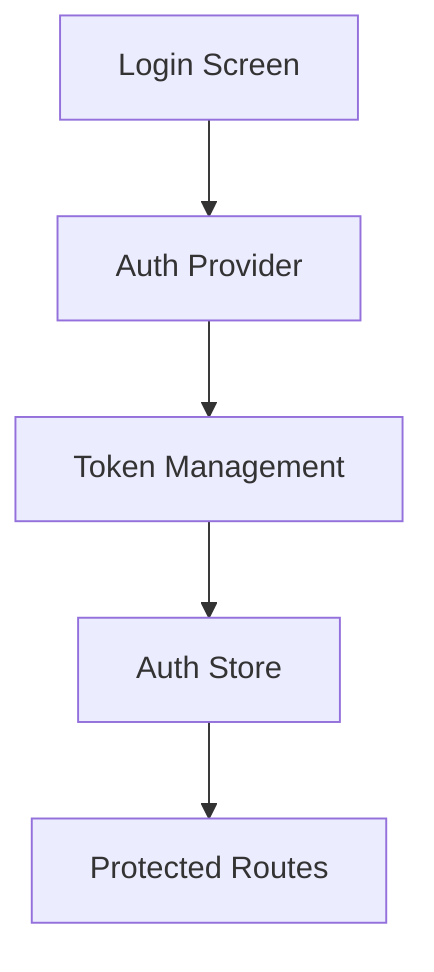
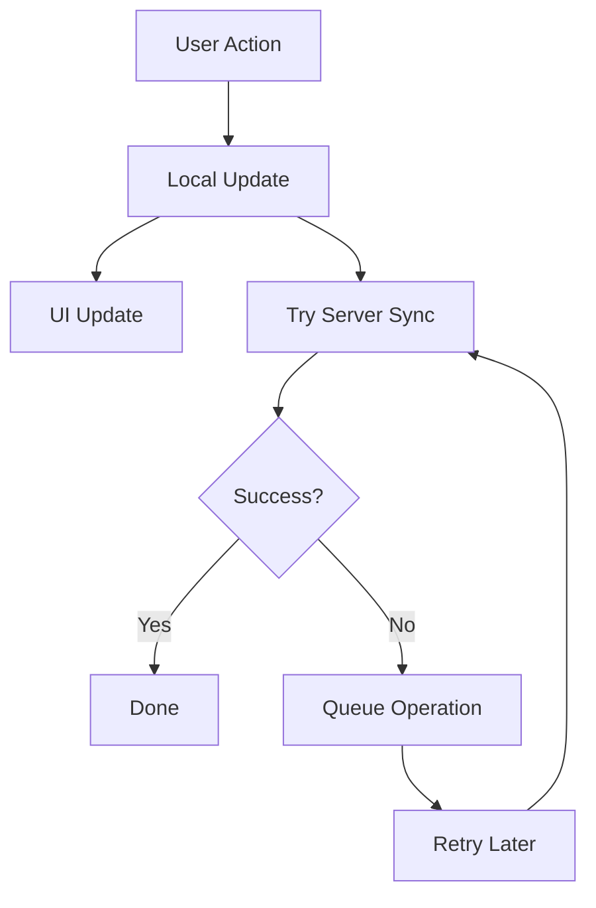
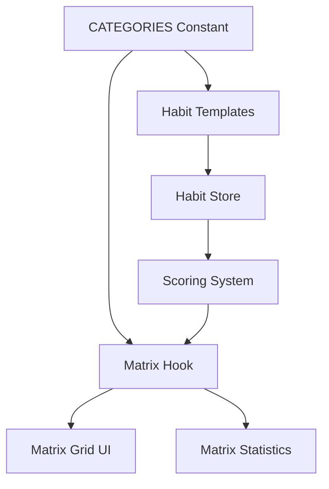

# System Patterns

## Architecture Overview

### Directory Structure

```
react-native-starter/
├── app/                   # Expo Router pages
├── components/            # Reusable components
├── interfaces/            # Zustand stores
├── types/                # TypeScript types
├── utils/                # Helper functions
├── constants/            # App constants
├── assets/              # Static assets
└── memory-bank/         # Project documentation
    ├── projectbrief.md  # Core requirements
    ├── productContext.md # Product context
    ├── systemPatterns.md # System architecture
    ├── techContext.md   # Technical setup
    ├── activeContext.md # Current state
    ├── progress.md     # Progress tracking
    └── App.md          # App-specific documentation
```

## Core Design Patterns

### State Management

1. **Zustand Store Pattern (`lib/interfaces/*_store.ts`)**

   ```typescript
   interface StoreState {
     /* Raw state */
   }
   export interface Store extends StoreState {
     actions: Actions;
     syncActions?: SyncActions;
     queryFunctions?: QueryFunctions; // Optional: simple queries can live here
   }
   ```

   - Separate state, actions, sync, queries.
   - Use TypeScript for type safety.
   - Implement persistence with MMKV/AsyncStorage via `persist` middleware.
   - Support offline-first operations via actions.
   - Sync mechanism with pending operations.

2. **Custom Hook Selectors (`lib/hooks/*.ts`)**

   ```typescript
   export const useSpecificData = (args) => {
     const rawData = useStore((state) => state.rawData); // Select minimal raw state
     return useMemo(() => {
       // Compute/filter derived data
     }, [rawData, args]); // Memoize based on raw data & args
   };
   ```

   - Encapsulate logic for selecting and computing derived state.
   - Subscribe to minimal raw state from the store.
   - Use `React.useMemo` to memoize calculations, preventing unnecessary re-renders.
   - Pass stable primitive types (strings, numbers) as arguments to hooks where possible.

3. **Component Data Usage**

   ```typescript
   function MyComponent(props) {
     const specificData = useSpecificData(props.stableId);
     // Render using specificData
   }
   ```

   - Components call custom hooks to get the exact memoized data they need.

### Component Patterns

- Functional components with hooks
- Props interface definitions
- Memoization via `React.memo` where needed
- Error boundary implementation

### Navigation Pattern

- File-based routing with Expo Router
- Type-safe navigation
- Deep linking support
- Modal and stack navigation

## Key Technical Decisions

### Authentication

- Multiple provider support (Apple, Google)
- Token-based authentication
- Secure storage strategy with MMKV
- Refresh token rotation

### Data Management

1. **Storage Strategy**

   - MMKV for performance-critical data
   - AsyncStorage for larger datasets
   - Supabase for backend storage
   - Offline sync capabilities

2. **State Updates**

   - Optimistic updates for instant feedback
   - Non-blocking state updates for UI responsiveness
   - Background sync with retry mechanism
   - Conflict resolution based on timestamps
   - Pending operations queue
   - Error handling with retry limits
   - Key Pattern: Avoid awaiting non-critical async operations that would block UI updates

3. **Sync Pattern**

   - Initial sync on app launch
   - Periodic sync (hourly)
   - Manual sync trigger support
   - Offline operation support
   - Conflict resolution strategy
   - Async operations run in background to prevent UI blocking

4. **State Selection/Derivation**
   - Prefer custom hooks with `useMemo` for selecting/deriving state over complex selectors within `create`
   - Keep state updates synchronous where possible for immediate UI feedback
   - Use non-blocking async operations for server sync

### Performance Optimization

1. **State Updates**

   - Immediate local state updates for UI responsiveness
   - Non-blocking async operations for server sync
   - Avoid awaiting non-critical operations
   - Measure and log critical operation timings for optimization
   - Use performance.now() for precise timing measurements

2. **UI Responsiveness**
   - Bottom sheet animations configured for optimal speed
   - Immediate feedback for user actions
   - Background processing for server operations
   - Optimistic UI updates

## Component Relationships

### Data Flow

```mermaid
graph TD
    Store[Zustand Store
      (Raw State)] --> Hooks[Custom Hooks
      (Select + Memoize)]
    Hooks --> Components[UI Components]
    Components --> Actions[Store Actions]
    Actions --> API[API Layer]
    API --> Storage[Local Storage]
    API --> Backend[Backend Services]
    API --> PendingOps[Pending Operations]
    PendingOps --> Sync[Sync Mechanism]
    Sync --> Backend
```

### Authentication Flow



### Sync Flow



## Error Handling

1. **Global Error Boundary**

   - Sentry integration
   - User-friendly error messages
   - Error recovery mechanisms
   - Debug logging

2. **Network Errors**
   - Retry logic with exponential backoff
   - Offline operation handling
   - User feedback for sync status
   - Data recovery through pending operations

## Testing Strategy

1. **Unit Tests**

   - Component testing
   - Store testing
   - Utility function testing
   - Mock implementations
   - Sync mechanism testing
   - Custom hook testing

2. **Integration Tests**
   - Navigation flows
   - API integration
   - Authentication flows
   - State management
   - Offline capability testing

## Security Patterns

1. **Data Security**

   - Secure storage
   - Data encryption
   - Token management
   - Input validation
   - Sync data validation

2. **Network Security**
   - HTTPS enforcement
   - Certificate pinning
   - Request signing
   - Rate limiting
   - Sync request validation

## Sync Implementation

1. **Core Components**

   - Pending operations queue
   - Retry mechanism
   - Conflict resolution
   - Error handling
   - Status tracking

2. **Integration Points**

   - App initialization sync
   - Post-login sync
   - Periodic background sync
   - Manual sync trigger
   - Error recovery

3. **Best Practices**
   - Optimistic updates first
   - Queue failed operations
   - Retry with backoff
   - Clear error messaging
   - Status indicators

## New Interface: Habits

1. **Zustand Store for Habits**

   - Similar to user_profile store pattern
   - First let's check the database schema from Supabase
   - Create proper TypeScript types
   - Implement the store with MMKV persistence

## Calendar Day Visualization Pattern

### WeekView Day States

The calendar day visualization uses a focused approach that concentrates completion status on the number itself:

1. Base Container

```typescript
const styles = StyleSheet.create({
  container: {
    height: 80,
    backgroundColor: '#fff', // Always white for clean look
  },
  dayContainer: {
    width: DAY_WIDTH,
    height: 70,
    justifyContent: 'center',
    alignItems: 'center',
  },
});
```

2. Selected State

```typescript
selectedDay: {
  backgroundColor: '#E3F2FF', // Light blue that works with both white and blue
  borderRadius: 12,
}
```

3. Completion States (focused on number)

```typescript
// Partial completion - circle border
someCompletedNumber: {
  borderWidth: 1.5,
  borderColor: '#007AFF',
  borderRadius: 16,
},
// Full completion - filled circle
allCompletedNumber: {
  backgroundColor: '#007AFF',
  borderRadius: 16,
}
```

4. Today State

```typescript
todayText: {
  color: '#007AFF', // Blue text for today
}
```

### Visual Hierarchy

1. Container always stays white
2. Selected day has light blue background
3. Completion status shown on number only:
   - No completion: Regular number
   - Partial: Blue circle border
   - Complete: Blue filled circle
4. Today indicated by blue text

### Key Implementation Details

- Use nested Views for number container to handle borders and backgrounds separately
- Keep completion status focused on the number for clarity
- Use borderRadius equal to half width/height for perfect circles
- Selected state uses a color that works with both white and blue elements

### Style Structure

```typescript
<TouchableOpacity
  style={[styles.dayContainer, isSelected && styles.selectedDay]}
>
  <Text style={[styles.dayName, isToday && styles.todayText]}>
    {date.format('ddd')}
  </Text>
  <View
    style={[
      styles.numberContainer,
      completionStatus === 'some_completed' && styles.someCompletedNumber,
    ]}
  >
    <View
      style={[
        styles.numberBackground,
        completionStatus === 'all_completed' && styles.allCompletedNumber,
      ]}
    >
      <Text
        style={[
          styles.dayNumber,
          isToday && styles.todayText,
          completionStatus === 'all_completed' && styles.allCompletedText,
        ]}
      >
        {date.format('D')}
      </Text>
    </View>
  </View>
</TouchableOpacity>
```

## Matrix System Architecture

### Category Management

1. **Centralized Category Definitions (`lib/constants/HabitTemplates.ts`)**

   ```typescript
   // Single source of truth for category IDs
   export const CATEGORY_IDS = [
     'body',
     'mind',
     'heart',
     'spirit',
     'work',
   ] as const;
   export type HabitCategory = (typeof CATEGORY_IDS)[number];

   // Complete category metadata
   export const CATEGORIES = [
     {
       id: 'body',
       name: 'Body',
       icon: 'body',
       description: 'Physical health and wellbeing',
       color: '#FF5E5B',
     },
     // ... other categories
   ] as const;
   ```

   - All category references use this centralized definition
   - Type-safe category IDs through TypeScript literal types
   - Complete metadata for UI components
   - Used by habit templates and scoring system

2. **Matrix Score Calculation (`lib/utils/scoring.ts`)**

   ```typescript
   interface DisplayedMatrixScore {
     body: number;
     mind: number;
     heart: number;
     spirit: number;
     work: number;
     calculated_at: Date;
   }
   ```

   - Exponential smoothing algorithm for score updates
   - Configurable smoothing factor and lookback window
   - Category-specific baseline scores
   - Daily progress score (DPS) calculation
   - Dynamic Matrix Score (DMS) computation

3. **Matrix Hook (`lib/hooks/useMatrix.ts`)**

   ```typescript
   interface MatrixCategory {
     id: (typeof CATEGORY_IDS)[number] | 'total';
     name: string;
     score: number;
     color: string;
     icon: string;
     description?: string;
   }
   ```

   - Memoized matrix calculations
   - Real-time score updates
   - Balance score computation
   - Integration with habit completion tracking
   - Efficient re-rendering optimization

### Matrix Data Flow



### Scoring System

1. **Daily Progress Score (DPS)**

   - Calculated per category
   - Based on completed habits vs. total active habits
   - Skipped habits excluded from calculation
   - Score range: 0-100

2. **Dynamic Matrix Score (DMS)**

   - Uses exponential smoothing
   - Configurable parameters:
     - SMOOTHING_FACTOR = 0.02 (α)
     - LOOKBACK_WINDOW = 14 days
   - Baseline scores from user profile
   - Real-time updates on habit completion

3. **Balance Score**
   - Average of all category scores
   - Updates dynamically with individual scores
   - Represents overall life balance

### Matrix Grid Implementation

1. **Visual Representation**

   - Category-specific colors
   - Icon-based category identification
   - Score visualization
   - Interactive elements

2. **Performance Optimization**

   - Memoized calculations
   - Efficient re-rendering
   - Background score updates
   - Smooth animations

3. **User Interaction**
   - Category selection
   - Score history viewing
   - Quick habit access
   - Progress visualization

## Other System Patterns

[Previous patterns remain unchanged...]

## State Management

### Shared Store Utilities

The application uses a shared utilities pattern for store management, located in `lib/stores/shared.ts`. This provides:

- Base interfaces and types for consistent store implementation
- Utility functions for error handling and user management
- Constants for retry attempts and intervals
- Async storage helpers for persistence

```typescript
// Core shared interfaces
interface BaseState {
  lastSyncTime: Date;
  isLoading: boolean;
  error: string | null;
}

interface BasePendingOperation {
  id: string;
  type: 'create' | 'update' | 'delete';
  timestamp: Date;
  retryCount: number;
  lastAttempt?: Date;
}
```

### Store Implementation Pattern

Each store follows a consistent pattern:

1. **Base State Extension**

   - Extends BaseState
   - Includes local state (Maps/Arrays)
   - Defines pending operations

2. **CRUD Operations**

   - Local state update first
   - Server sync attempt
   - Fallback to pending operations

3. **Sync Management**
   - Periodic sync with server
   - Pending operations processing
   - Error handling and retry logic

### Achievement System

The achievement system uses:

- Streak-based achievements
- Local state management
- Server synchronization
- Pending operations for offline support

### Habits System

The habits system implements:

- Complex habit tracking
- Completion status management
- Progress calculation
- Streak tracking
- Offline support with pending operations

## Data Flow Patterns

### Optimistic Updates

1. Update local state immediately
2. Attempt server sync
3. Queue failed operations
4. Retry failed operations periodically

### Error Handling

Consistent error handling pattern:

```typescript
const errorHandler = createErrorHandler<State>(set);
// Usage
try {
  // Operation
} catch (error) {
  errorHandler.setError(error as Error);
}
```

### Persistence

- Uses AsyncStorage for local persistence
- Implements custom storage adapter
- Handles serialization/deserialization

## Authentication Pattern

- User ID required for operations
- Throws error if user not logged in
- Consistent user ID retrieval:

```typescript
const userId = getUserIdOrThrow();
```

### Date Handling Pattern

1. **Core Date Library**

   ```typescript
   // Always import from our custom instance
   import dayjs from '@/lib/utils/dayjs';
   ```

2. **Standard Operations**

   ```typescript
   // Date normalization
   const normalizedDate = dayjs(date).startOf('day');

   // Date comparisons
   const isInRange = startDate.isSameOrBefore(targetDate, 'day');

   // Day of week
   const dayOfWeek = dayjs(date).day(); // 0 = Sunday

   // Formatting
   const formatted = dayjs(date).format();
   ```

3. **Best Practices**

   - Use custom dayjs instance from `@/lib/utils/dayjs`
   - Avoid native Date methods
   - Use dayjs's type-safe comparison methods
   - Store dates in ISO format
   - Convert to Date using `toDate()` when storing in state/database

4. **Common Use Cases**

   ```typescript
   // In hooks
   const useDataForDate = (date: Date) => {
     return useMemo(() => {
       const targetDate = dayjs(date);
       // Use dayjs methods for comparisons
     }, [date]);
   };

   // In components
   const MyComponent = ({ date }: { date: Date }) => {
     const normalizedDate = dayjs(date).startOf('day');
     // Use normalized date for operations
   };

   // In stores
   const store = create<State>()((set) => ({
     setDate: (date: Date) =>
       set({
         date: dayjs(date).toDate(),
       }),
   }));
   ```
