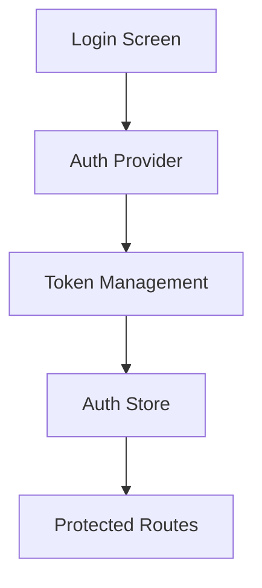
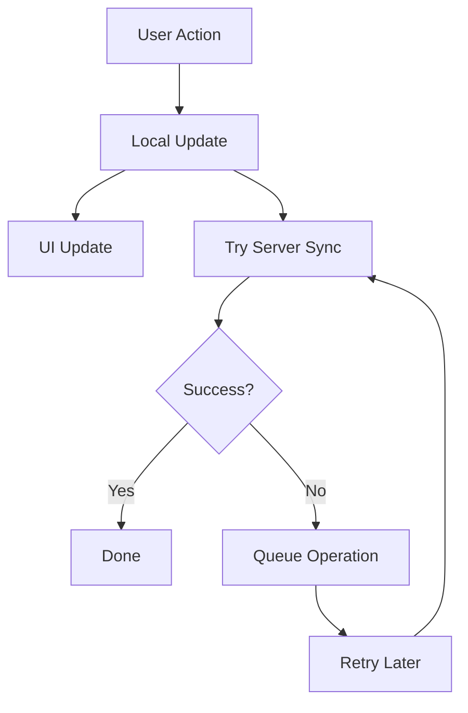
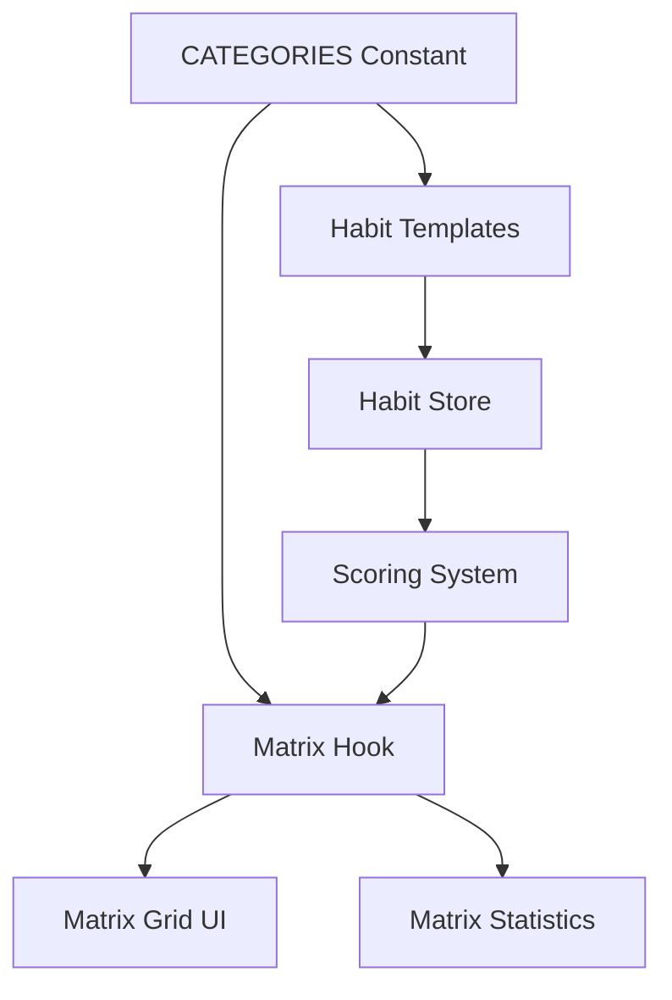

# System Patterns

## Architecture Overview

### Directory Structure

```
HabitsLab/
├── app/                   # Expo Router pages
│   ├── (app)/            # Main app routes
│   │   ├── (tabs)/       # Tab navigation (home, stats, achievements, settings)
│   │   ├── add-habit/    # Add habit modal
│   │   └── update-habit/ # Edit habit modal
│   └── onboarding/       # Onboarding flow
├── components/           # Reusable UI components
│   ├── habits/          # Habit-specific components
│   ├── achievements/    # Achievement system components
│   ├── calendar/        # Calendar and date components
│   ├── matrix/          # Matrix score visualization
│   ├── modals/          # Modal components
│   └── shared/          # Shared UI components
├── lib/                 # Core application logic
│   ├── habit-store/     # Main habit store with slices
│   ├── stores/          # Additional Zustand stores
│   ├── hooks/           # Custom React hooks
│   ├── utils/           # Helper functions
│   ├── i18n/            # Internationalization utilities
│   └── constants/       # App constants
├── targets/             # Native iOS widget implementation
│   └── widget/          # Swift widget code
├── supabase/            # Backend configuration
├── assets/              # Static assets
└── memory-bank/         # Project documentation
```

## Core Design Patterns

### State Management

1. **Zustand Store Pattern with Subscriptions & Deferred Calculations**

   ```typescript
   // Store creation with subscribeWithSelector middleware
   const useStore = create<SharedSlice>()(
     subscribeWithSelector(
       persist(
         (set, get, api) => ({
           // Initial state combining modular slices
           ...createHabitSlice(set, get, api),
           ...createCompletionSlice(set, get, api),
           ...createCalendarSlice(set, get, api),
           ...createAchievementSlice(set, get, api),
           ...createSyncSlice(set, get, api),
         }),
         options
       )
     )
   );

   // Efficient state change tracking
   useStore.subscribe(
     (state) => ({
       // Track multiple state changes in one selector
       stateA: state.someData,
       stateB: new Set(state.collection.keys()),
       count: state.items.size,
     }),
     (newState, oldState) => {
       // Handle state changes efficiently
       if (newState.stateA !== oldState.stateA) {
         // Handle stateA changes
       }
       if (newState.stateB.size !== oldState.stateB.size) {
         // Handle collection size changes
       }

       // Heavy calculations can be deferred slightly
       if (needsHeavyRecalculation(newState, oldState)) {
         setTimeout(() => {
           state.performHeavyRecalculation();
         }, 100);
       }
     }
   );
   ```

   - Use `subscribeWithSelector` for efficient state tracking
   - Combine multiple state changes in one selector
   - Use Sets and size tracking for efficient collection comparison
   - Avoid infinite loops in calculations
   - Trigger side effects based on specific state changes
   - **Optimization:** Defer potentially heavy calculations triggered by subscriptions using `setTimeout` to avoid blocking the main thread.

2. **Custom Hook Selectors (`lib/hooks/*.ts`)**

   ```typescript
   export const useSpecificData = (args) => {
     const rawData = useStore((state) => state.rawData); // Select minimal raw state
     return useMemo(() => {
       // Compute/filter derived data
     }, [rawData, args]); // Memoize based on raw data & args
   };
   ```

   - Encapsulate logic for selecting and computing derived state.
   - Subscribe to minimal raw state from the store.
   - Use `React.useMemo` to memoize calculations, preventing unnecessary re-renders.
   - Pass stable primitive types (strings, numbers) as arguments to hooks where possible.

3. **Component Data Usage**

   ```typescript
   function MyComponent(props) {
     const specificData = useSpecificData(props.stableId);
     // Render using specificData
   }
   ```

   - Components call custom hooks to get the exact memoized data they need.

### Component Patterns

- Functional components with hooks
- Props interface definitions
- Memoization via `React.memo` where needed
- Error boundary implementation

### Navigation Pattern

- File-based routing with Expo Router
- Type-safe navigation
- Deep linking support
- Modal and stack navigation

## Key Technical Decisions

### Authentication

- Multiple provider support (Apple, Google, Facebook)
- Token-based authentication
- Secure storage strategy with MMKV
- Refresh token rotation
- OAuth 2.0 flows for all providers
- Enhanced authentication session management with expo-auth-session
- Cryptographic functions support with expo-crypto

#### Facebook Authentication Pattern

```typescript
// Facebook SDK integration pattern
import { LoginManager, AccessToken } from 'react-native-fbsdk-next';

const handleFacebookLogin = async () => {
  try {
    const result = await LoginManager.logInWithPermissions([
      'public_profile',
      'email',
    ]);

    if (result.isCancelled) {
      // Handle cancellation
      return;
    }

    const data = await AccessToken.getCurrentAccessToken();
    if (data) {
      // Use access token for Supabase authentication
      const { user, error } = await supabase.auth.signInWithOAuth({
        provider: 'facebook',
        options: {
          accessToken: data.accessToken,
        },
      });
    }
  } catch (error) {
    // Handle error
  }
};
```

- Facebook SDK configuration with FACEBOOK_APP_ID and FACEBOOK_CLIENT_TOKEN
- Integration with existing Supabase authentication flow
- Consistent user experience across all authentication providers
- Secure token handling and storage

### Data Management

1. **Storage Strategy**

   - MMKV for performance-critical data
   - AsyncStorage for larger datasets
   - Supabase for backend storage
   - Offline sync capabilities

2. **Subscription Management**

   - Superwall SDK for paywall presentation and management
   - Native subscription handling with App Store/Play Store integration
   - A/B testing capabilities for paywall optimization
   - Real-time analytics and user journey tracking

3. **Internationalization (i18n)**

   - i18next for translation management
   - react-i18next for React Native integration
   - Translation utilities for measurement units, categories, progress text, and achievements
   - Fallback strategy with default values
   - Dynamic pluralization and value insertion support

4. **State Updates**

   - Optimistic updates for instant feedback
   - Non-blocking state updates for UI responsiveness
   - Background sync with retry mechanism
   - Conflict resolution based on timestamps
   - Pending operations queue
   - Error handling with retry limits
   - Key Pattern: Avoid awaiting non-critical async operations that would block UI updates

5. **Sync Pattern**

   - Initial sync on app launch
   - Periodic sync (hourly)
   - Manual sync trigger support
   - Offline operation support
   - Conflict resolution strategy
   - Async operations run in background to prevent UI blocking

6. **State Selection/Derivation**
   - Prefer custom hooks with `useMemo` for selecting/deriving state over complex selectors within `create`
   - Keep state updates synchronous where possible for immediate UI feedback
   - Use non-blocking async operations for server sync

### Performance Optimization

1. **State Updates**

   - Immediate local state updates for UI responsiveness
   - Non-blocking async operations for server sync
   - Avoid awaiting non-critical operations
   - Measure and log critical operation timings for optimization
   - Use performance.now() for precise timing measurements

2. **UI Responsiveness**
   - Bottom sheet animations configured for optimal speed
   - Immediate feedback for user actions
   - Background processing for server operations
   - Optimistic UI updates

## Component Relationships

### Data Flow

```mermaid
graph TD
    Store[Zustand Store
      (Raw State)] --> Hooks[Custom Hooks
      (Select + Memoize)]
    Hooks --> Components[UI Components]
    Components --> Actions[Store Actions]
    Actions --> API[API Layer]
    API --> Storage[Local Storage]
    API --> Backend[Backend Services]
    API --> PendingOps[Pending Operations]
    PendingOps --> Sync[Sync Mechanism]
    Sync --> Backend
```

### Authentication Flow



### Sync Flow



## Error Handling

1. **Global Error Boundary**

   - Sentry integration
   - User-friendly error messages
   - Error recovery mechanisms
   - Debug logging

2. **Network Errors**
   - Retry logic with exponential backoff
   - Offline operation handling
   - User feedback for sync status
   - Data recovery through pending operations

## Testing Strategy

1. **Unit Tests**

   - Component testing
   - Store testing
   - Utility function testing
   - Mock implementations
   - Sync mechanism testing
   - Custom hook testing

2. **Integration Tests**
   - Navigation flows
   - API integration
   - Authentication flows
   - State management
   - Offline capability testing

## Security Patterns

1. **Data Security**

   - Secure storage
   - Data encryption
   - Token management
   - Input validation
   - Sync data validation

2. **Network Security**
   - HTTPS enforcement
   - Certificate pinning
   - Request signing
   - Rate limiting
   - Sync request validation

## Sync Implementation

1. **Core Components**

   - Pending operations queue
   - Retry mechanism
   - Conflict resolution
   - Error handling
   - Status tracking

2. **Integration Points**

   - App initialization sync
   - Post-login sync
   - Periodic background sync
   - Manual sync trigger
   - Error recovery

3. **Best Practices**
   - Optimistic updates first
   - Queue failed operations
   - Retry with backoff
   - Clear error messaging
   - Status indicators

## New Interface: Habits

1. **Zustand Store for Habits**

   - Similar to user_profile store pattern
   - First let's check the database schema from Supabase
   - Create proper TypeScript types
   - Implement the store with MMKV persistence

## Calendar Day Visualization Pattern

### WeekView Day States

The calendar day visualization uses a focused approach that concentrates completion status on the number itself:

1. Base Container

```typescript
const styles = StyleSheet.create({
  container: {
    height: 80,
    backgroundColor: '#fff', // Always white for clean look
  },
  dayContainer: {
    width: DAY_WIDTH,
    height: 70,
    justifyContent: 'center',
    alignItems: 'center',
  },
});
```

2. Selected State

```typescript
selectedDay: {
  backgroundColor: '#E3F2FF', // Light blue that works with both white and blue
  borderRadius: 12,
}
```

3. Completion States (focused on number)

```typescript
// Partial completion - circle border
someCompletedNumber: {
  borderWidth: 1.5,
  borderColor: '#007AFF',
  borderRadius: 16,
},
// Full completion - filled circle
allCompletedNumber: {
  backgroundColor: '#007AFF',
  borderRadius: 16,
}
```

4. Today State

```typescript
todayText: {
  color: '#007AFF', // Blue text for today
}
```

### Visual Hierarchy

1. Container always stays white
2. Selected day has light blue background
3. Completion status shown on number only:
   - No completion: Regular number
   - Partial: Blue circle border
   - Complete: Blue filled circle
4. Today indicated by blue text

### Key Implementation Details

- Use nested Views for number container to handle borders and backgrounds separately
- Keep completion status focused on the number for clarity
- Use borderRadius equal to half width/height for perfect circles
- Selected state uses a color that works with both white and blue elements

### Style Structure

```typescript
<TouchableOpacity
  style={[styles.dayContainer, isSelected && styles.selectedDay]}
>
  <Text style={[styles.dayName, isToday && styles.todayText]}>
    {date.format('ddd')}
  </Text>
  <View
    style={[
      styles.numberContainer,
      completionStatus === 'some_completed' && styles.someCompletedNumber,
    ]}
  >
    <View
      style={[
        styles.numberBackground,
        completionStatus === 'all_completed' && styles.allCompletedNumber,
      ]}
    >
      <Text
        style={[
          styles.dayNumber,
          isToday && styles.todayText,
          completionStatus === 'all_completed' && styles.allCompletedText,
        ]}
      >
        {date.format('D')}
      </Text>
    </View>
  </View>
</TouchableOpacity>
```

## Matrix System Architecture

### Category Management

1. **Centralized Category Definitions (`lib/constants/HabitTemplates.ts`)**

   ```typescript
   // Single source of truth for category IDs
   export const CATEGORY_IDS = [
     'body',
     'mind',
     'heart',
     'spirit',
     'work',
   ] as const;
   export type HabitCategory = (typeof CATEGORY_IDS)[number];

   // Complete category metadata
   export const CATEGORIES = [
     {
       id: 'body',
       name: 'Body',
       icon: 'body',
       description: 'Physical health and wellbeing',
       color: '#FF5E5B',
     },
     // ... other categories
   ] as const;
   ```

   - All category references use this centralized definition
   - Type-safe category IDs through TypeScript literal types
   - Complete metadata for UI components
   - Used by habit templates and scoring system

2. **Matrix Score Calculation (`lib/utils/scoring.ts`)**

   ```typescript
   interface DisplayedMatrixScore {
     body: number;
     mind: number;
     heart: number;
     spirit: number;
     work: number;
     calculated_at: Date;
   }
   ```

   - Exponential smoothing algorithm for score updates
   - Configurable smoothing factor and lookback window
   - Category-specific baseline scores
   - Daily progress score (DPS) calculation
   - Dynamic Matrix Score (DMS) computation
   - **Location:** `lib/utils/achievements.ts` (Confirm this, looks like DMS is here now)

3. **Matrix Hook (`lib/hooks/useMatrix.ts`)**

   ```typescript
   interface MatrixCategory {
     id: (typeof CATEGORY_IDS)[number] | 'total';
     name: string;
     score: number;
     color: string;
     icon: string;
     description?: string;
   }
   ```

   - Memoized matrix calculations
   - Real-time score updates
   - Balance score computation
   - Integration with habit completion tracking
   - Efficient re-rendering optimization
   - **Location:** `lib/utils/achievements.ts`

### Matrix Data Flow



### Scoring System

1. **Daily Progress Score (DPS)**

   - Calculated per category
   - Based on completed habits vs. total active habits
   - Skipped habits excluded from calculation
   - Score range: 0-100

2. **Dynamic Matrix Score (DMS)**

   - Uses exponential smoothing
   - Configurable parameters:
     - SMOOTHING_FACTOR = 0.02 (α)
     - LOOKBACK_WINDOW = 14 days
   - Baseline scores from user profile
   - Real-time updates on habit completion
   - **Location:** `lib/utils/achievements.ts` (Confirm this, looks like DMS is here now)

3. **Balance Score**
   - Average of all category scores
   - Updates dynamically with individual scores
   - Represents overall life balance

### Matrix Grid Implementation

1. **Visual Representation**

   - Category-specific colors
   - Icon-based category identification
   - Score visualization
   - Interactive elements

2. **Performance Optimization**

   - Memoized calculations
   - Efficient re-rendering
   - Background score updates
   - Smooth animations

3. **User Interaction**
   - Category selection
   - Score history viewing
   - Quick habit access
   - Progress visualization

## iOS Widgets Implementation

### Architecture Overview

HabitsLab implements iOS widgets using `@bacons/apple-targets` with two distinct widgets:

- **Calendar Widget**: Weekly overview for medium/large sizes (StaticConfiguration)
- **Interactive Widget**: Daily completion toggling for all sizes (AppIntentConfiguration)

### Data Sharing Pattern

- **App Group ID**: `group.com.vdl.habitapp.widget`
- **Storage**: Direct `UserDefaults` integration with JSON serialization
- **Sync Flow**: React Native app → UserDefaults → Swift widgets → Timeline refresh

### Key Components

1. **Shared Swift Code**

   - `HabitStore.swift`: Core data management (loadHabits, saveHabits)
   - `Models.swift`: Codable Habit struct with weeklyStatus
   - `DateUtils.swift`: ISO8601 UTC date formatting consistency

2. **Widget Types**

   - **Calendar Widget**: Read-only weekly progress display
   - **Interactive Widget**: `ToggleHabitIntent` for direct habit completion

3. **Data Synchronization**
   - Date keys use ISO8601 UTC format (`2024-01-15T00:00:00.000Z`)
   - Automatic timeline refresh after interactions
   - Background execution without app opening

### Implementation Pattern

```swift
// Widget registration
@main
struct HabitsWidgetBundle: WidgetBundle {
    var body: some Widget {
        WeeklyHabitsWidget()      // Calendar widget
        InteractiveHabitWidget()  // Interactive widget
    }
}
```

### Performance Considerations

- Efficient JSON parsing for widget requirements
- Minimal data structure for performance
- SwiftUI best practices for widget views
- Optimized timeline management

## Other System Patterns

## State Management

### Zustand Stores

We use Zustand for global state management across the application. Each major feature has its own dedicated store:

1. `habits_store.ts` - Manages habit data, completions, and sync
2. `user_profile_store.ts` - Handles user profile and related settings (Confirm if `auth_store.ts` exists or was replaced)
3. `achievements_store.ts` - Tracks user achievements
4. `modal_store.ts` - Centralizes modal management

All stores follow consistent patterns:

```typescript
export const useHabitsStore = create<SharedSlice>()(
  subscribeWithSelector(
    persist(
      immer((set, get, api) => ({
        // State & Actions combined from modular slices
        ...createHabitSlice(set, get, api),
        ...createCompletionSlice(set, get, api),
        ...createCalendarSlice(set, get, api),
        ...createAchievementSlice(set, get, api),
        ...createSyncSlice(set, get, api),
      })),
      {
        name: 'habits-store',
        storage: {
          // MMKV storage implementation
        },
      }
    )
  )
);
```

### Performance Storage with MMKV

We've migrated from AsyncStorage to MMKV for improved performance. MMKV is a key-value storage system that offers significantly better performance than AsyncStorage.

Implementation pattern:

```typescript
// Create MMKV instance for a specific store
const habitsMmkv = new MMKV({ id: 'habits-store' });

// Configure storage interface
storage: {
  getItem: (name) => {
    const value = habitsMmkv.getString(name);
    if (!value) return null;
    return JSON.parse(value);
  },
  setItem: (name, value) => {
    habitsMmkv.set(name, JSON.stringify(value));
  },
  removeItem: (name) => {
    habitsMmkv.delete(name);
  },
},
```

Benefits:

- Faster read/write operations
- Better app startup performance
- Reduced memory usage
- Native implementation for better stability

### Selector Hooks

Custom hooks for data selection follow this pattern:

```typescript
export const useHabitsForDate = (date: Date): Habit[] => {
  const normalizedDate = useMemo(() => {
    return normalizeDate(date);
  }, [date.toISOString().split('T')[0]]);

  return useHabitsStore(
    useCallback(
      (state) => {
        return state.getHabitsForDate(normalizedDate);
      },
      [normalizedDate]
    )
  );
};
```

### Utility Functions

- Core habit logic moved to `lib/utils/habits.ts` (e.g., `calculateDateStatus`, `getHabitStatus`)
- Core achievement/scoring logic moved to `lib/utils/achievements.ts` (e.g., `calculateCurrentStreak`, `calculateDMS`)

## UI Patterns

### Modal System

The application now uses a centralized modal system with the following architecture:

1. **Modal Store**: `modal_store.ts` manages the state of all modals in the application

   ```typescript
   export type ModalType = 'achievement' | 'confirmation' | 'settings' | null;

   interface ModalState {
     currentModal: ModalType;
     // Modal-specific state and actions
   }
   ```

2. **Modal Container**: A single component that renders the appropriate modal based on the current state

   ```tsx
   const ModalContainer = () => {
     const { currentModal, hideModal } = useModalStore();

     return (
       <>
         {currentModal === 'achievement' && (
           <AchievementsModal onDismiss={hideModal} />
         )}

         {currentModal === 'confirmation' && (
           <ConfirmationModal onDismiss={hideModal} />
         )}

         {/* Other modal types */}
       </>
     );
   };
   ```

3. **Modal Components**: Individual modal implementations with specific functionality

   - `AchievementsModal`: Displays unlocked achievements with confetti animation (automatically triggered)
   - More modals to be added as needed

4. **Triggering Modals**: Achievement modals are now automatically triggered from the achievement calculation system

   ```typescript
   // Achievement modals are automatically shown when achievements are unlocked
   // in the achievement calculation logic (calculateAndUpdate)
   if (unlockedAchievements.length > 0) {
     useModalStore.getState().showAchievementModal(unlockedAchievements);
   }
   ```

   Other modals can still be triggered manually:

   ```typescript
   const { showSettingsModal, showSortModal } = useModalStore();

   // Show specific modals
   showSettingsModal();
   showSortModal();
   ```

Benefits:

- Centralized modal management
- Consistent UX across modal types
- Simplified modal creation and usage
- Decoupled modal logic from components

### Notification System

1. **Setup and Configuration**

   ```typescript
   // Configure notification handling
   Notifications.setNotificationHandler({
     handleNotification: async () => ({
       shouldShowAlert: true,
       shouldPlaySound: true,
       shouldSetBadge: true,
     }),
   });
   ```

2. **Registration and Permissions**

   - Platform-specific setup (iOS/Android)
   - Permission handling
   - Token management
   - Backend integration

3. **Notification Types**

   - Local notifications for reminders
   - Push notifications for updates
   - Scheduled notifications
   - Custom notification channels (Android)

4. **Usage Pattern**

   ```typescript
   // Schedule notification
   const scheduleNotification = async ({ title, body, trigger }) => {
     const id = await Notifications.scheduleNotificationAsync({
       content: { title, body },
       trigger,
     });
     return id;
   };
   ```

## Native Extensions (iOS Widgets)

- **Technology:** Swift, SwiftUI, WidgetKit, AppIntents
- **Build System:** `@bacons/expo-apple-targets` integrated into the Expo project.
- **Data Sharing:**
  - Uses **App Groups** (`group.com.vdl.habitapp.widget`) to enable shared data access.
  - `UserDefaults` within the App Group container stores habit data as a JSON string.
  - A shared `HabitStore.swift` module encapsulates loading/saving logic for `UserDefaults`.
  - **Crucial:** Consistent data structures (`Habit` model in `Models.swift`) and date formatting (ISO8601 UTC with fractional seconds) must be maintained between the React Native app and Swift code.
- **Widget Types:**
  - **Calendar Widget (`WeeklyHabitsWidget`):**
    - Uses `StaticConfiguration`.
    - Displays weekly habit progress (read-only).
    - Supports `.systemMedium`, `.systemLarge` families.
    - UI built with SwiftUI (`CalendarViews.swift`).
  - **Interactive Widget (`InteractiveHabitWidget`):**
    - Uses `AppIntentConfiguration` with `ToggleHabitIntent`.
    - Allows users to toggle habit completion for the current day directly from the widget.
    - Supports `.systemSmall`, `.systemMedium`, `.systemLarge` families with adaptive SwiftUI layouts (`InteractiveViews.swift`).
    - `ToggleHabitIntent` handles:
      - Receiving `habitID`.
      - Loading data via `HabitStore`.
      - Modifying `weeklyStatus` for the correct UTC date key.
      - Saving data via `HabitStore`.
      - Triggering widget timeline reloads (`WidgetCenter.shared.reloadAllTimelines()`).
- **Shared Code:** Common Swift code (Models, Utils, DataStore) is placed in a `Shared/` directory within `targets/widget/`.
- **Configuration:**
  - Widget registration occurs in `targets/widget/index.swift`.
  - App Group entitlement is configured in `targets/widget/generated.entitlements`.

### iOS Widget Integration

1.  **Data Sharing: App Group + UserDefaults**

    - React Native app writes data to shared `UserDefaults` within a specific App Group (`group.com.vdl.habitapp.widget`).
    - Swift widgets read data from the same shared `UserDefaults` using the App Group ID.
    - Requires configuring App Groups in both the main app target and the widget extension target.

2.  **Native Module Bridge (`widget-storage`)**

    - A custom Expo native module (`widget-storage`) provides React Native access to the App Group's `UserDefaults`.
    - Exposes methods like `setItem`, `getItem`, `removeItem` for RN code to interact with the shared data store.
    - Exposes `reloadAllTimelines` to allow the RN app to trigger widget updates.

3.  **Swift Shared Code**

    - Common Swift code (`Shared/Models.swift`, `Shared/DateUtils.swift`, `Shared/HabitStore.swift`) is used by both the Calendar and Interactive widgets.
    - `HabitStore.swift` centralizes loading/saving logic for the `UserDefaults` data.

4.  **Widget Types & Configuration**

    - **StaticConfiguration (`CalendarWidget`)**: Displays data without user interaction, suitable for periodic timeline updates.
    - **AppIntentConfiguration (`InteractiveWidget`)**: Uses App Intents (`ToggleHabitIntent`) to handle user interactions directly within the widget, updating data and triggering timeline reloads without opening the main app.

5.  **Timeline Management**
    - Widgets use `TimelineProvider` (`CalendarProvider`, `InteractiveProvider`) to provide snapshots and timeline entries.
    - `WidgetCenter.shared.reloadAllTimelines()` is called (from RN via the bridge, or from Swift Intents) to inform iOS that widget data has changed and timelines need refreshing.

## State Management (Zustand)

- **`useUserProfileStore` (`lib/stores/user_profile.ts`)**: Manages all user-specific data, including profile details, onboarding status, and notification preferences (`allow_streak_notifications`, `allow_daily_update_notifications`).
  - Persists data to local device storage using `react-native-mmkv`.
  - Implements optimistic local updates with background synchronization to the Supabase `users` table for all profile modifications.
  - The `UserProfile` type is derived directly from Supabase-generated types (`Database['public']['Tables']['users']['Row']`) ensuring consistency.
- **`useAppStore` (`lib/stores/app_state.ts`)**: Manages global app-level state, primarily the master `notificationsEnabled` toggle. This toggle reflects whether the app has permission and is set up to receive _any_ notifications at the device level.
  - Persists data to local device storage using `react-native-mmkv`.
- **`useHabitsStore` (`lib/habit-store/store.ts`)**: Manages all habit-related data, including habits, completions, and achievements.
  - Implements a more complex synchronization pattern with `pendingOperations` queue for robust offline support and conflict resolution when syncing with Supabase tables (`habits`, `habit_completions`, `user_achievements`).

**General Pattern:**

- Stores are the single source of truth for client-side data.
- Actions within stores are responsible for both local state updates and backend synchronization.
- `react-native-mmkv` is used for encrypting and persisting sensitive store data locally.
- `dayjs` is used for all date/time manipulations, ensuring consistency.

## Supabase Integration

- **Client**: The Supabase client is initialized in `supabase/client.ts` and used across the application for database interactions and authentication.
- **Authentication**: Handled via Supabase Auth, supporting email/password, Google, and Apple sign-ins. Onboarding flows (`OnboardingLogin.tsx`) correctly create/update user records in the `users` table and initialize local state via `useUserProfileStore`.
- **Database**: User profiles, habits, completions, achievements, and scheduled notifications are stored in Supabase tables.
  - The `users` table includes `allow_streak_notifications` and `allow_daily_update_notifications` columns to store user preferences.
- **Types**: TypeScript types for Supabase tables and enums are generated and located in `supabase/types.ts`. These are used throughout the app, including for the `UserProfile` type in the store.
- **Edge Functions**:
  - **`daily-update-note`**: Sends morning/evening summary notifications.
    - Fetches users from the `users` table, filtering by those who have `push_token` and `allow_daily_update_notifications` set to `true`.
    - Logic resides in `supabase/functions/daily-update-note/index.ts` and `utils.ts`.
  - **`streak-note`**: Sends notifications when a user is close to achieving a streak milestone.
    - Fetches users from the `users` table, filtering by those who have `push_token` and `allow_streak_notifications` set to `true`.
    - Contains refactored logic in `utils.ts` to calculate current streaks based on habit completions and determine eligibility for streak notifications.
    - Logic resides in `supabase/functions/streak-note/index.ts` and `utils.ts`.
  - **General Pattern for Edge Functions**: Functions are written in TypeScript, use Deno runtime, and interact with the Supabase database using the Supabase JS client.

## Navigation (Expo Router)

- Utilizes Expo Router for file-based routing.
- Main navigation is tab-based: `(tabs)` layout.
- Onboarding flow: `(onboarding)` group with unified authentication in OnboardingLogin.tsx that handles both sign-in and sign-up for Google, Apple, and Facebook.
- Settings and other user-specific screens are within the main app stack.

## UI Components

- Primarily uses React Native core components.
- Custom components are organized within `components/`.
- Styling is generally done using StyleSheet, with some inline styles. Constants like `Colors` are defined in `lib/constants/Colors.ts`.

## Error Handling and Logging

- `react-native-toast-message` is used for user-facing error messages (e.g., login failures, Supabase sync issues from stores if not handled at component level).
- `console.error` is used for logging errors in development, particularly in store synchronization logic and Edge Functions.
- PostHog is used for analytics and event tracking, including signup events.

## Key Technical Decisions & Patterns

- **Optimistic Updates**: For `useUserProfileStore`, local state is updated immediately, and Supabase sync happens in the background. For `useHabitsStore`, a more robust pending operations queue is used.
- **Single Source of Truth**: Stores aim to be the single source of truth for client-side data. Supabase is the backend source of truth.
- **Type Safety**: TypeScript is used throughout, with generated Supabase types ensuring consistency with the backend schema.
- **Separation of Concerns**: Logic for data fetching, manipulation, and synchronization is largely encapsulated within Zustand stores or specific service/utility files for Edge Functions.

### State Management

1. **Habit Sorting Pattern**

   ```typescript
   // Store slice with sort_id support
   export const createHabitSlice: StateCreator<
     SharedSlice,
     [],
     [],
     HabitSlice
   > = (set, get) => ({
     updateHabitOrder: async (habitIds: string[]) => {
       // Optimistic local update
       set((state) => {
         const newHabits = new Map(state.habits);
         habitIds.forEach((id, index) => {
           const habit = newHabits.get(id);
           if (habit) {
             newHabits.set(id, {
               ...habit,
               sort_id: index + 1,
               updated_at: dateUtils.toServerDateTime(new Date()),
             });
           }
         });
         return { habits: newHabits };
       });

       try {
         // Server sync
         for (let i = 0; i < habitIds.length; i++) {
           await supabase
             .from('habits')
             .update({
               sort_id: i + 1,
               updated_at: dateUtils.toServerDateTime(new Date()),
             })
             .eq('id', habitIds[i]);
         }
       } catch (error) {
         // Add to pending operations for offline support
         const pendingOp = createPendingOperation('update', 'habits', data);
         set((state) => ({
           pendingOperations: [...state.pendingOperations, pendingOp],
         }));
       }
     },
   });

   // Sorting utility
   export function sortHabits<
     T extends { sort_id: number | null; created_at: string }
   >(habits: T[]): T[] {
     return [...habits].sort((a, b) => {
       if (a.sort_id !== null && b.sort_id !== null)
         return a.sort_id - b.sort_id;
       if (a.sort_id !== null) return -1;
       if (b.sort_id !== null) return 1;
       return (
         new Date(a.created_at).getTime() - new Date(b.created_at).getTime()
       );
     });
   }
   ```

2. **UI Component Patterns**

   ```typescript
   // Reusable Button Pattern
   export function Button({
     onPress,
     label,
     type = 'primary',
   }: {
     onPress: () => void;
     label: string;
     type: 'primary' | 'secondary';
   }) {
     return (
       <TouchableOpacity
         style={[styles.button, type === 'secondary' && styles.secondary]}
         activeOpacity={ACTIVE_OPACITY}
         onPress={onPress}
       >
         <Text style={styles.label}>{label}</Text>
       </TouchableOpacity>
     );
   }

   // Automatic Icon Tinting
   export const getIconTint = (hex: string) => {
     const [r, g, b] = hex.match(/\w\w/g)!.map((v) => parseInt(v, 16));
     const yiq = (r * 299 + g * 587 + b * 114) / 1000;
     return yiq > 150 ? colors.text : '#FFFFFF';
   };
   ```

3. **Modal Pattern**

   ```typescript
   // Modal Type Definition
   export type ModalType =
     | 'achievement'
     | 'confirmation'
     | 'settings'
     | 'sort'
     | null;

   // Modal Container Pattern
   const ModalContainer = () => {
     const { currentModal, hideModal } = useModalStore();

     return (
       <>
         {currentModal === 'sort' && <SortModal onDismiss={hideModal} />}
         {/* Other modal types */}
       </>
     );
   };
   ```

## iOS Widget Architecture

### Widget Configuration System

1. **Shared Configuration Architecture**

   ```swift
   // Unified configuration intent for both widgets
   struct HabitConfigurationIntent: WidgetConfigurationIntent {
       @Parameter(title: "Habits to Display")
       var selectedHabits: [HabitEntity]?

       static var parameterSummary: some ParameterSummary {
           When(\.$selectedHabits, .hasAnyValue) {
               Summary("Display selected habits") {
                   \.$selectedHabits
               }
           } otherwise: {
               Summary("Display all habits")
           }
       }
   }

   // Shared provider for both calendar and interactive widgets
   struct SharedHabitConfigurationProvider: AppIntentTimelineProvider {
       typealias Entry = ConfigurableEntry
       typealias Intent = HabitConfigurationIntent

       func timeline(for configuration: HabitConfigurationIntent, in context: Context) async -> Timeline<ConfigurableEntry> {
           // Unified timeline generation logic
       }
   }
   ```

2. **Configurable Entry Pattern**

   ```swift
   struct ConfigurableEntry: TimelineEntry {
       let date: Date
       let habits: [Habit]
       let selectedHabitIds: [String]

       // Computed property for display logic
       var displayHabits: [Habit] {
           if selectedHabitIds.isEmpty {
               return Array(habits.prefix(10)) // Default behavior
           } else {
               return habits.filter { selectedHabitIds.contains($0.id) }
           }
       }
   }
   ```

3. **Widget Entity System**

   ```swift
   struct HabitEntity: AppEntity {
       static var typeDisplayRepresentation: TypeDisplayRepresentation = "Habit"
       static var defaultQuery = HabitEntityQuery()

       var displayRepresentation: DisplayRepresentation {
           DisplayRepresentation(
               title: "\(name)",
               subtitle: "Tap to toggle selection"
           )
       }
   }

   struct HabitEntityQuery: EntityQuery {
       func suggestedEntities() async throws -> [HabitEntity] {
           // Load and convert habits to entities
       }
   }
   ```

### Widget UI Design Patterns

1. **Card-Based Layout System**

   ```swift
   struct HabitCard: View {
       let habit: Habit

       var body: some View {
           ZStack {
               // Base background with habit color
               RoundedRectangle(cornerRadius: 16)
                   .fill(habitColor.opacity(0.38))

               // Progress overlay
               GeometryReader { geometry in
                   HStack {
                       RoundedRectangle(cornerRadius: 16)
                           .fill(habitColor)
                           .frame(width: geometry.size.width * progress)
                       Spacer(minLength: 0)
                   }
               }

               // Content layer with icon, text, and action button
               HStack {
                   // Icon, habit info, action button
               }
           }
       }
   }
   ```

2. **Multi-Size Widget Support**

   ```swift
   private var maxHabits: Int {
       switch family {
       case .systemSmall: return 2   // 1 column, 2 rows
       case .systemMedium: return 4  // 2 columns, 2 rows
       case .systemLarge: return 10  // 2 columns, 4 rows
       @unknown default: return 2
       }
   }
   ```

3. **Icon Tinting System**

   ```swift
   func getIconTint(hex: String, opacity: Double = 1.0) -> Color {
       // Calculate brightness and return appropriate tint
       let yiq = (adjustedR * 299 + adjustedG * 587 + adjustedB * 114) / 1000
       return yiq > 150 ? .primary : .white
   }
   ```

### Widget Integration Patterns

1. **App Intent Integration**

   ```swift
   // Toggle habit completion
   struct ToggleHabitIntent: AppIntent {
       @Parameter(title: "Habit ID")
       var habitID: String

       func perform() async throws -> some IntentResult {
           // Update habit completion status
           return .result()
       }
   }

   // Open main app
   struct OpenAppIntent: AppIntent {
       static var openAppWhenRun: Bool = true

       func perform() async throws -> some IntentResult {
           return .result()
       }
   }
   ```

2. **Conditional Widget Actions**

   ```swift
   Group {
       if isCompletedToday {
           // Use Link for completed habits
           Link(destination: URL(string: "habitapp://")!) {
               habitCardContent
           }
       } else {
           // Use Button for incomplete habits
           Button(intent: ToggleHabitIntent(habitID: habit.id)) {
               habitCardContent
           }
       }
   }
   ```

## Subscription & Paywall Patterns

### Superwall Integration Pattern

```typescript
// Superwall SDK integration pattern
import { Superwall } from '@superwall/react-native-superwall';

// Initialize Superwall
const initializeSuperwall = async () => {
  try {
    await Superwall.configure({
      apiKey: Platform.OS === 'ios' ? SUPERWALL_IOS_KEY : SUPERWALL_ANDROID_KEY,
      // Additional configuration options
    });
  } catch (error) {
    console.error('Superwall initialization failed:', error);
  }
};

// Present paywall
const presentPaywall = async (identifier: string) => {
  try {
    const result = await Superwall.presentPaywall(identifier);
    // Handle paywall result
    return result;
  } catch (error) {
    console.error('Paywall presentation failed:', error);
  }
};

// Track events for paywall triggers
const trackEvent = (eventName: string, parameters?: Record<string, any>) => {
  Superwall.track(eventName, parameters);
};
```

- Superwall configuration with platform-specific API keys
- Paywall presentation with identifier-based triggers
- Event tracking for user journey analysis
- Error handling for paywall operations
- Integration with existing subscription logic

### Configuration Management

```typescript
// Constants for Superwall configuration
export const SUPERWALL_IOS_KEY =
  'pk_d2c6fffef9269bf986d44f399fdde452d5ae8fcb2d7a776b';
export const SUPERWALL_ANDROID_KEY =
  'pk_f4e5875ecf0124e849be07bbb51d16ea5df8800f95aa183d';

// Platform-specific initialization
const getSuperwallConfig = () => ({
  apiKey: Platform.OS === 'ios' ? SUPERWALL_IOS_KEY : SUPERWALL_ANDROID_KEY,
  userId: user?.id,
  // Additional configuration based on platform
});
```

- Centralized configuration management
- Platform-specific API key handling
- User identification for personalized paywalls
- Scalable configuration patterns
