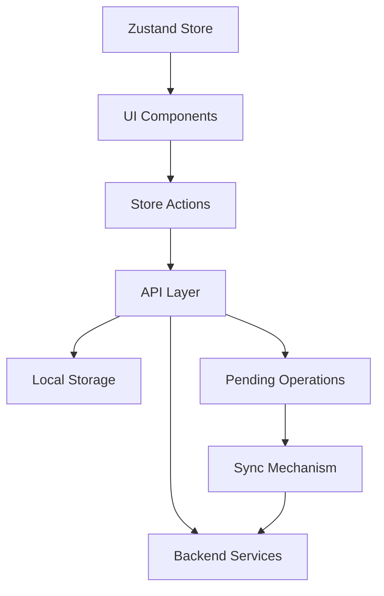
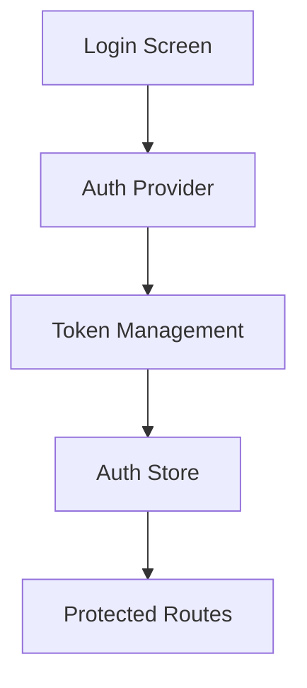
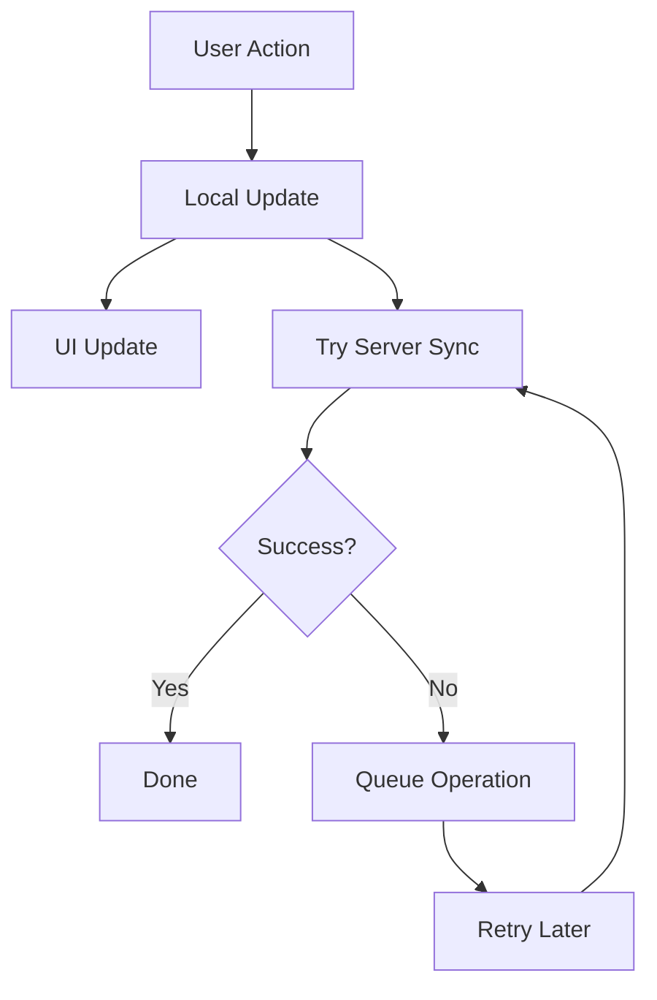

# System Patterns

## Architecture Overview

### Directory Structure

```
react-native-starter/
├── app/                   # Expo Router pages
├── components/            # Reusable components
├── interfaces/            # Zustand stores
├── types/                # TypeScript types
├── utils/                # Helper functions
├── constants/            # App constants
└── assets/              # Static assets
```

## Core Design Patterns

### State Management

1. **Zustand Store Pattern**

   ```typescript
   interface Store {
     state: State;
     actions: Actions;
     syncActions: SyncActions;
   }
   ```

   - Separate state and actions
   - Use TypeScript for type safety
   - Implement persistence with MMKV/AsyncStorage
   - Support offline-first operations
   - Sync mechanism with pending operations

2. **Component Patterns**

   - Functional components with hooks
   - Props interface definitions
   - Memoization where needed
   - Error boundary implementation

3. **Navigation Pattern**
   - File-based routing with Expo Router
   - Type-safe navigation
   - Deep linking support
   - Modal and stack navigation

## Key Technical Decisions

### Authentication

- Multiple provider support (Apple, Google)
- Token-based authentication
- Secure storage strategy with MMKV
- Refresh token rotation

### Data Management

1. **Storage Strategy**

   - MMKV for performance-critical data
   - AsyncStorage for larger datasets
   - Supabase for backend storage
   - Offline sync capabilities

2. **State Updates**

   - Optimistic updates for instant feedback
   - Background sync with retry mechanism
   - Conflict resolution based on timestamps
   - Pending operations queue
   - Error handling with retry limits

3. **Sync Pattern**
   - Initial sync on app launch
   - Periodic sync (hourly)
   - Manual sync trigger support
   - Offline operation support
   - Conflict resolution strategy

### Performance Optimization

1. **Rendering**

   - React.memo for expensive components
   - Virtual lists for large datasets
   - Image optimization
   - Lazy loading

2. **Network**
   - Request caching
   - Retry mechanisms
   - Background data prefetch
   - Connection status handling

## Component Relationships

### Data Flow



### Authentication Flow



### Sync Flow



## Error Handling

1. **Global Error Boundary**

   - Sentry integration
   - User-friendly error messages
   - Error recovery mechanisms
   - Debug logging

2. **Network Errors**
   - Retry logic with exponential backoff
   - Offline operation handling
   - User feedback for sync status
   - Data recovery through pending operations

## Testing Strategy

1. **Unit Tests**

   - Component testing
   - Store testing
   - Utility function testing
   - Mock implementations
   - Sync mechanism testing

2. **Integration Tests**
   - Navigation flows
   - API integration
   - Authentication flows
   - State management
   - Offline capability testing

## Security Patterns

1. **Data Security**

   - Secure storage
   - Data encryption
   - Token management
   - Input validation
   - Sync data validation

2. **Network Security**
   - HTTPS enforcement
   - Certificate pinning
   - Request signing
   - Rate limiting
   - Sync request validation

## Sync Implementation

1. **Core Components**

   - Pending operations queue
   - Retry mechanism
   - Conflict resolution
   - Error handling
   - Status tracking

2. **Integration Points**

   - App initialization sync
   - Post-login sync
   - Periodic background sync
   - Manual sync trigger
   - Error recovery

3. **Best Practices**
   - Optimistic updates first
   - Queue failed operations
   - Retry with backoff
   - Clear error messaging
   - Status indicators

## New Interface: Habits

1. **Zustand Store for Habits**

   - Similar to user_profile store pattern
   - First let's check the database schema from Supabase
   - Create proper TypeScript types
   - Implement the store with MMKV persistence
